_[Git](https://github.com/afriedman412/r-b_billboard_charts)_  
I really like funk and R&B from the 70's and 80's and I have spent a lot of my life digging through crates full of old records. That's really all the background there is for this project.

I definitely don't think anything here beyond the basic concept would be useful for the modern music industry. Billboard metrics change with the times, and the 70s and 80s were just very different. This is less an exercise in business strategy than a chance to crack myself up by having Luther Vandross and Evelyn "Champagne" King show up in my data.

All data acquired using [Allen Guo's rad Python wrapper for the Billboard API](https://github.com/guoguo12/billboard-charts).

## One Important Note
Since Billboard charts are numbered backwards, with #1 being the best and #50 being the bottom of the chart, describing movement on the chart can be confusing.

**For this notebook, everything corresponds to absolute direction.**  

Negative movement 'down' the chart is good, while positive movement 'up' the chart is bad.

(So for example,  an album that moves from #6 to #2 has moved four places 'down' the chart, and its movement is -4.)

# Data Exploration
---
My data is the 'R&B and Hip-Hop' charts from 1975 to 1985, although I scraped a wider range than that to give the albums at either end of the window the proper values. (Otherwise my data would say every album charting on 1/1/1975 debuted that week, for example.) When all was said and done, I have 28673 entries for 2020 albums by 691 artists.

As one would expect, distribution of chart positions is uniform.

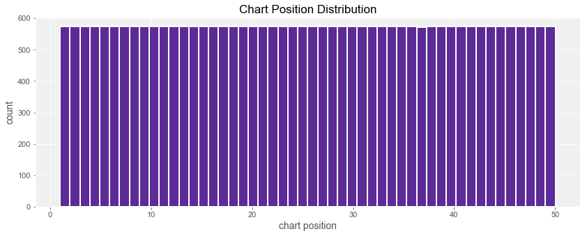

# Some Observations About Chart Movement
### Chart position are reasonably predictable.
Every album follows a parabolic path, starting high, descending, stabilizing, then reversing course until they are off the chart.

These Al Green albums are good examples of typical chart movement.

However, the speed at which any of these steps happens is the variable: a highly anticipated album could hit \#1 from the jump and stay there for weeks, while a breakout album slowly gaining traction could take months before it reaches its peak.

For example, Chic's self-titled 1978 debut took 7 weeks to climb from \#45 its peak at \#12. Its took almost 3 more months before it was off the charts. Chic's sophomore album, "C'est Chic", debuted at \#3, hit \#1 the next week and stayed on top of the chart for another 3 months. But even though it was more successful, "C'est Chic" charted for 4 fewer weeks.

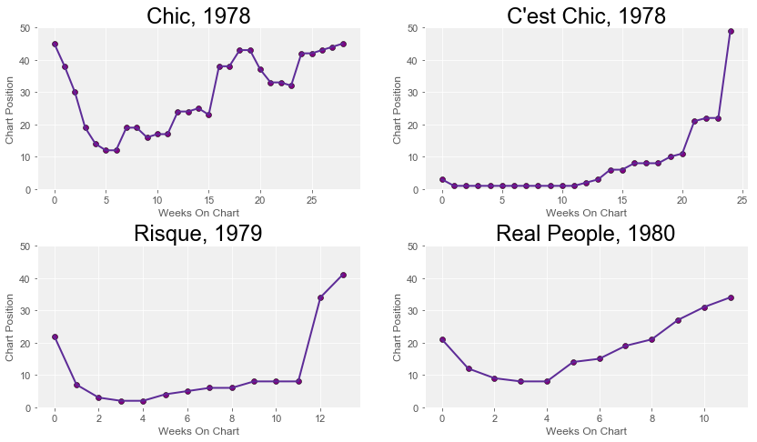

### Chart Movement Is Slow
It's rare for an album to jump more than a handful of positions from week to week. As shown on the distributions of the three features measuring chart to chart change, the vast majority of the values are below 5.

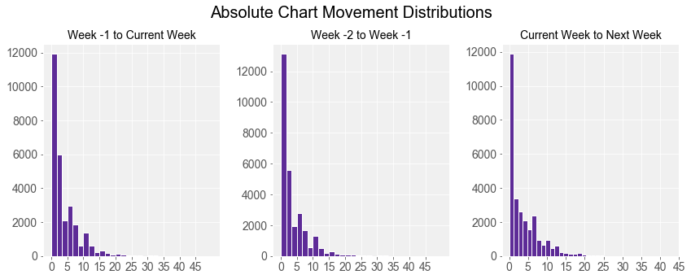

### Albums Have Momentum
An album moving in one direction tends to stay moving in that direction. As shown on the plots below, the size and direction of the movement in consecutive weeks are correlated.

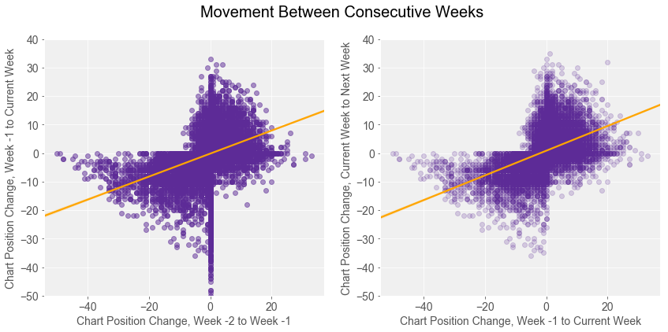

But while previous movement is a fairly good predictor of where an album will go next, it's not perfect. As shown below, previous movement only predicts next movement about half the time.

    % Identical Motion from Week -2 to Week -1 and Week -1 to Current Week:
    0.497785372999
    
    % Identical Motion from Week -1 to Current Week: and Current Week to Next Week
    0.539880724026
    
    Average % Identical Motion in Consecutive Weeks
    0.518833048513

# Features
---

### Weeks on Chart
For example, as an album stays on the charts, it becomes less likely to move, and more likely to move upward if it does move.

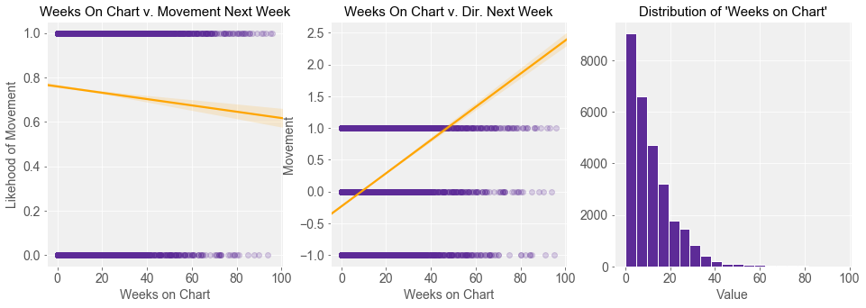

### Chart Position
While worse-charting albums are more likely to move, it's tough to say which direction they will go.

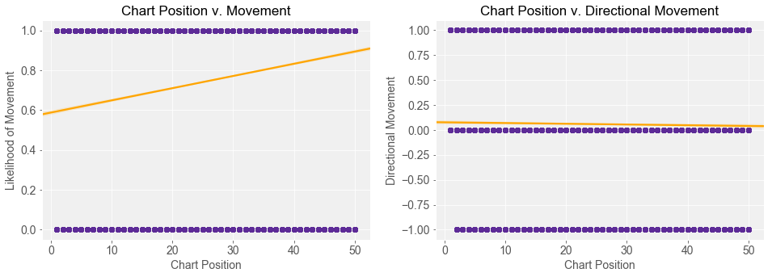

### Performance of Artist's Last Album
I also included the length of time the artist's last album stayed on the charts and its peak position as a way of contextualizing their popularity.

The longer an artist's last album charted, the less likely it is to move week to week, and slightly more likely to move up.

The peak chart position of an artist's last album depresses its chance of movement slightly, and has a mild effect on direction of movement as well.

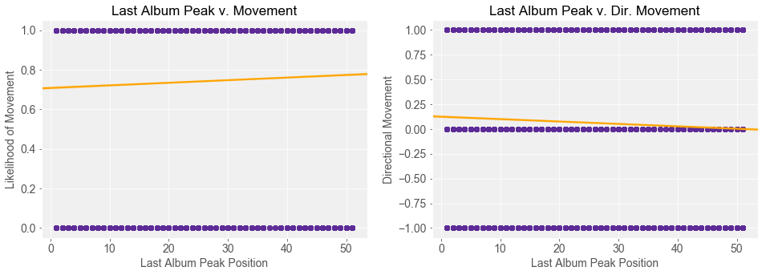

# Modeling
---

Models used the following features:

 **name** | | **data**
 :---|---|:---
 position  | | chart position on that date   
 delta_1 | | movement between last chart and this chart  
 delta_2 | |  movement between two charts ago and last chart  
 weeks_on_chart | | how many consecutive weeks the album has charted  
 peak_lag | |peak chart position of artist's previous album  
 weeks_lag | | how many consecutive weeks the artist's previous album charted  
 
 Depending on the goal, models used one of these two targets:

  **name** | | **data**
 :---|---|:---
 move | | binary: 0 for no movement, 1 for movement
 move_2n| | -1 for downward movement, 0 for no movement, 1 for upward movement

I chose four diverse classification algorithms for my models:
- [Random Forest Classifier (from sci-kit learn)](http://scikit-learn.org/stable/modules/generated/sklearn.ensemble.RandomForestClassifier.html)
- [XGBoost Classifier](https://xgboost.readthedocs.io/en/latest/)
- [K-Neighbors Classifier (from sci-kit learn)](http://scikit-learn.org/stable/modules/generated/sklearn.neighbors.KNeighborsClassifier.html)
- [Stochastic Descent Gradient Classifier with modified Huber loss function (from sci-kit learn)](http://scikit-learn.org/stable/modules/generated/sklearn.linear_model.SGDClassifier.html)

Random Forest is a straightforward algorithm that gives a good indication if the data can be modeled. XGBoost is more robust. K-Neighbors is non-parametric and thus can sometimes find patterns that elude other models. SGD is careful and conservative.

### Distribution of Target Classes

 **Up**: 0.400621  
 **Down**: 0.342761  
 **Stay**: 0.256618  

Upward chart movement makes up about 40% of the target class. That is our baseline accuracy for classification.

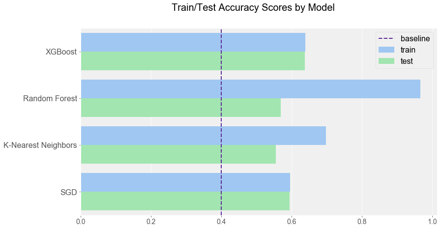

All four models are more accurate than the baseline. But how well do they predict the individual outcomes?

Rather than predicting all three outcomes at a consistant rate, the models are far better at predicting direction than whether an album will move.

Across all the models, recall for 'stay' (no movement) is substantially lower than for the other two categories. This indicates a lot of false negatives.

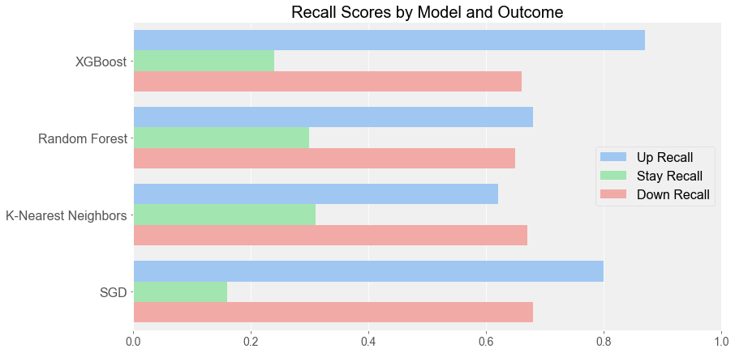

### Predicting Movement v. Predicting Direction
To verify this trend, here's the same models predicting only whether an album will or will not move.

Since the ratio of 'move' to 'stay' is about 3:1 in the data, I transformed my training set with the [imbalanced learn SMOTE](http://contrib.scikit-learn.org/imbalanced-learn/stable/generated/imblearn.over_sampling.SMOTE.html) package to simulate a better class balance and (hopefully) get better results. Even so, none of the algorithms beat the baseline accuracy, and all show disappointing recall.

(While SGD does have a high recall for 'stay', it has the lowest values for all other metrics. It's doing something different, but it's still not good.)

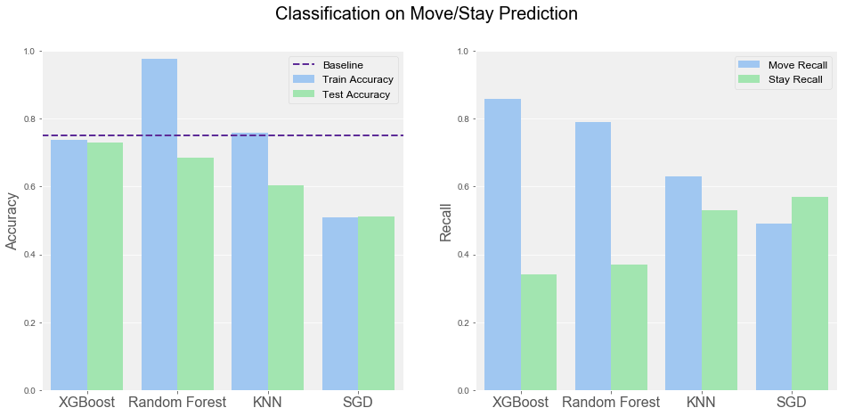

On the other hand, the model predicts movement direction fairly well when only given a subset of the data that moves. Accuracy clears baseline and recall scores jump up to around 0.7.

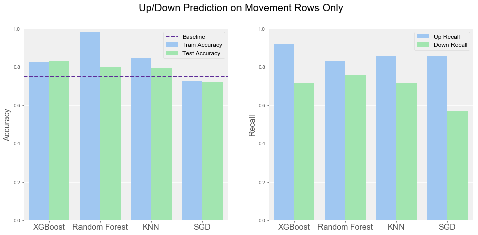

# Interpretation
---

### 2 Problems In One
It's clear from the results of these models that I made a fundamental misintreptation of the data. Whether an album's chart position changes from week to week is an entirely different question than which direction it will move if it does.

My model sought to answer two questions at once. Not surprisingly, it answers neither reliably.

### Next Steps
The most obvious way to improve the model would be to add more data, and the easiest way to do so would be to add more lag columns. Given the relative predictability of chart movement, it's reasonable to assume lower chart positions would be more stable, and that this model just lacked the data to make that connection.

A more ambitious approach would be to find more ways to give the model more cultural context. This project started as an attempt to make predictions based solely on album personnel, with the idea that talent might translate into success. This ultimately failed, as did attempts to add personnel-based features to the time series model, but the concept was sound.

Another solution could be to treat this as a regression problem rather than a classification problem. Rather than predicting movement, the model would predict something like momentum: a measure of where an album is tending to go. It would, however, take further work to make this number into an interpretable metric.
