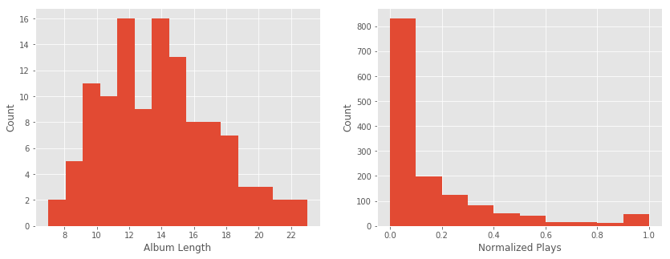
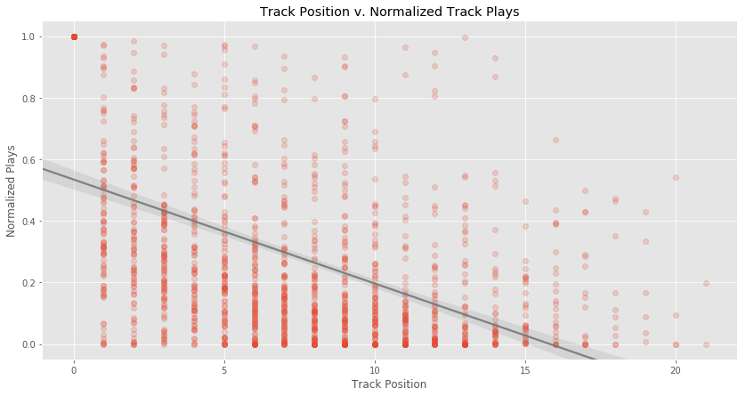
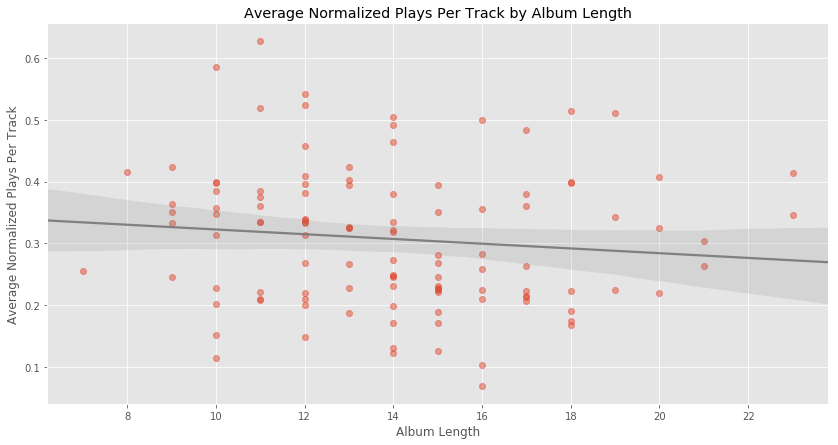
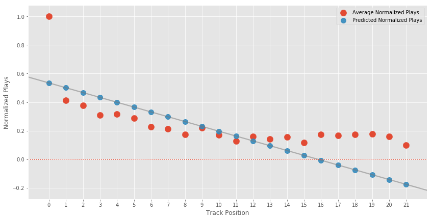
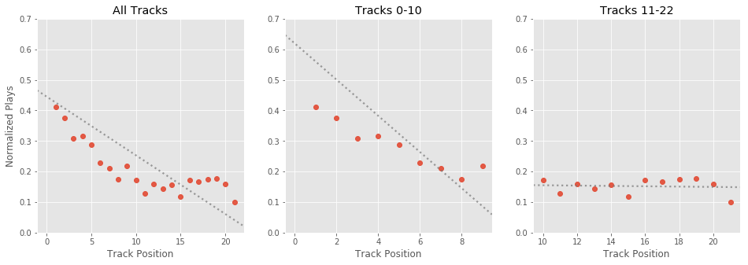

_[Git](https://github.com/afriedman412/mixtape_length)_   
How long should a rap mixtape be? It's a long-standing question, and one whose answer has swung wildly throughout the years. When physical media and radio ruled, it was simple: You were limited by concrete things like the length of blank tapes or your radio slot. Your selections had to fill two 30 or 45 minute sides, or an hour or two of air time, and that was that. But starting in the late 90's, things changed. Whether it was because rap became a more reliable hustle or because the price of recording and distribution dropped, the importance of, uh, non-album content increased exponentially.

Before the rise of digital music, artists who wanted to be heard basically had to either press up expensive vinyl, or physically show up and rap on the air. The ability to burn a session to CD and have it in circulation the next day opened up all kinds of new possibilities. You could do a whole CD of you rapping over whatever was hot every week if you wanted. If you had a buzz, you could do a whole tape with your crew without worrying about spreading your resources too thin. (DJ's, for their part, suddenly had new ways to leverage and monetize their connections.)

The lower bar for recording and releasing predictably led to more music, especially if people were buying. With mixtapes were going for $10 a pop, it made sense to test the limits of demand. So while official albums were still on a reasonable ~12-month cycle, things moved much faster at street level. The internet only pushed things further. CD's were still limited to 80-minutes, but DatPiff was less stringent. There was no reason for Gucci Mane to not put out three mixtapes in one day, or for Lil B to have 100+ MySpace accounts, each with 8 unique tracks, or for Gorilla Zoe to put out a tape every day for the entire month of February 2010.

Things have evened out somewhat since then, I think. There is still entirely too much music, but I feel like there's also been a cross-cultural realization that "music" is just "content", and diversification of content is crucial for a modern celebrity. Maybe instead of 25 tracks a month, do 12 tracks evey two months and be funny on IG. Or, in the extreme, get famous for something unrelated to rapping and then record your first song. But long-as-hell tapes no longer seem the norm, and seem no less common than self-proclaimed EP's of 6 to 10 songs.

Still, the point here is that people's attention spans are finite and are unaffected by the amount of music available. So there is an ideal album length, the point at which adding more songs is diminishing returns. Obviously, "will people listen to the whole thing" is only part of the equation for the modern artist, in an era where the algorithm judges you on some level on the size of your digital footprint. And the idea of listening to one project from front to back in order is increasingly outdated. But below, I will do my best to extrapolate the ideal rap mixtape length.

## Notes on the data
I'm making no distinction between a "mixtape", and "album", a "project", an "EP" or any other name for a multi-track musical recording released as a cohesive unit. There are some full-blown major label albums on the list, as well as some real small-timers. I tried to pick artists who are locally popular, but not quite in the mainstream. I also tried to get a geographically diverse group, but the south is probably overrepresented.

I used YouTube data because, frankly, it was the most readily available.

## Gathering the data
[I created a list of 133 projects from 74 different rappers](https://github.com/afriedman412/mixtape_length/blob/master/mixtape_links.csv). Drawing from the aritst's official YouTube pages (or, in a handful of cases, [DatPiff](https://www.youtube.com/channel/UC2SfCLE_jQgPwXQCWqwVIEw)), I then pulled the YouTube playlist ID for every project. With that ID, I used the YouTube API and [apiclient](https://pypi.org/project/apiclient/) to extract play counts for every track.

## Processing and feature engineering

#### Controlling for outside promotion
The fundamental question is how many songs will somebody who starts at track 1 and listens until they lose interest listen to a given project. But pretty much every single album in the data has tracks which had a video, were promoted as singles, or otherwise got exposure outside of the context of the album. These need to be purged from the data.

The obvious approach would be to treat these tracks like the outliers they are, and to remove anything with a play count more than 3 standard deviations from the mean. However, there's an even easier solution. Our listening paradigm mandates every listener hears the first track, so track 1 by definition has the most plays. Anything with more plays than the first track on its album is anamolous and can be removed from the analysis.

By setting a threshold for removed plays, this has the added benefit of acting as a way to control for any projects that don't follow our expectations. If more than 40% of an album's tracks have more plays than track 1, we remove the album from the data.

#### Controlling for variability in plays
The variability in fame across our artist means a lot of variability in play counts from project to project. So, after removing the anamolous tracks, we normalize play counts for every song to the first track of their album.

## Data exploration
After processing, we have 1415 tracks from 115 projects from 67 individual artists.

Album length is approximately normally distributed, with a mean of 14. Normalized play counts are mostly under 0.2, with a small peak at 1.0 (probably representing the first and second tracks). This is what we  expect to see.

Normalized plays decrease for larger track positions, also as expected: the further along on an album a song is, the less plays it gets. 

Album length and average plays are less strongly correlated. This is important because it indicates listener behavior isn't particularly affected by project length.

## Analysis
With our data, it's fairly straightforward to make a model that predicts normalized play count from track position. (I used [Scikit-Learn](http://scikit-learn.org/stable/modules/generated/sklearn.linear_model.LinearRegression.html).)

We could observe that at 17 (0-indexed) tracks the predicted play count drops below 0 and stop right there. Our data indicates every track over 17 is, statistically speaking, doing the whole project a disservice.

However, looking at the actual play counts, it's more of a plateau than a steady decline. The later tracks aren't helping, but they aren't doing much worse than anything else after about 11 tracks.

This is evident if we split the data at the 11th track.

This is kind of weird! What does it mean?

## Discussion and conclusion
For the first 11 tracks, the data behaves as expected: plays decline steadily as we get further into an album. At the 11th track, however, the decline stops and play counts appear to stabilize. (The average track 18 apparently outperforms track 13.)

If I had to guess, this plateau is probably a baseline measure of popularity of an artist. Radio play and video shoots are one way to push a track, but putting it high up on your album is another. So maybe the plateau after track 10 is how many plays a replacement level song by that artist in the context of that album would get. It's a useful idea, and possibly one that already has traction among people who get paid to do this kind of work for a living.

But the takeaway from this project, limited as its scope may be, is that your album does not need to be over 12 songs long, and it definitely doesn't need to be over 20.